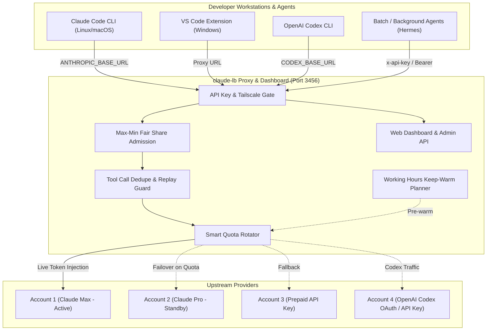

# ⚖️ agent-lb

> **Universal Multi-Account Load Balancer, Quota Rotator & Modern Web Dashboard for Claude Code & OpenAI Codex CLI.**

[](LICENSE)
[](https://nodejs.org)
[](docker/Dockerfile)
[](package.json)

`agent-lb` acts as an intelligent proxy between your coding tools ([Claude Code](https://claude.ai/claude-code), [VS Code Claude Extension](https://marketplace.visualstudio.com/items?itemName=Anthropic.claude-code), OpenAI Codex CLI, Cursor, Roo Code) and upstream providers (Anthropic, OpenAI). It pools multiple Claude (Max, Pro, Team, API-key) and OpenAI Codex accounts and automatically rotates traffic when limits are approached — preventing interruptions and 429 quota exhaustion.

---

## 🌟 Key Features

- **⚡ Multi-Account Pooling & Adaptive Rotation**: Pools multiple Anthropic & OpenAI Codex accounts and rotates before hitting 5-hour session or 7-day weekly rate limits (customizable threshold, default 98%).
- **🧠 OpenAI Codex & Anthropic Claude Dual Support**: Full proxy support for both Anthropic Claude (`/v1/messages`) and OpenAI Codex / ChatGPT (`/backend-api/codex`, `/backend-api/wham`, `/v1/responses`, `/v1/chat/completions`), with seamless OAuth PKCE and API key management.
- **⚖️ Max-Min Fair-Share Stream Admission**: Prevents interactive coding sessions from being starved by concurrent batch workloads or background autonomous agents (e.g. Hermes) by dynamically throttling aggressive consumers.
- **⏰ Smart Keep-Warm & Working Hours Planner**: Keeps sessions responsive before the workday begins, while automatically standing down on nights and weekends to conserve precious 5-hour and 7-day quota limits.
- **🛡️ Tool Call Deduplication & Replay Safety**: Tracks non-idempotent side-effect tool calls (file edits, bash execution) with deterministic fingerprinting, preventing duplicate executions during network hiccups and client retries.
- **📊 Real-time Web Dashboard**: Responsive web UI (`/dashboard`) monitoring account status, prepaid balances, active connections, token usage, provider badges, and client keys with live WebSocket & SSE updates.
- **🔄 In-Dashboard 1-Click OAuth Re-login**: Re-authenticate expired Anthropic or OpenAI Codex accounts directly through the web UI using OAuth flows without touching the server CLI.
- **🛠️ Zero-Config Client Connectors**: Instant 1-line setup scripts for Linux, macOS, WSL, and Windows PowerShell that configure Claude Code CLI, Codex CLI, and VS Code, handling OAuth credential backups and conflict prevention automatically.
- **👥 Multi-Tenant Client Keys**: Generate independent access keys (`tc-...`) with per-key token metrics, provider access controls (`allowedProviders`), rate limits, and permission scopes for team members.
- **🪶 Zero External Dependencies**: 100% pure Node.js built-ins (`http`, `https`, `crypto`, `net`). Extremely lightweight, starts in milliseconds.
- **🔒 Secure by Default**: Automatic loopback and Tailscale Tailnet bypass, constant-time API key comparisons, strict Content Security Policy (CSP), and zero secrets in git.
- **🐳 Docker & systemd Ready**: Out-of-the-box Docker container and native systemd service integration.

---

## 🏗️ Architecture



---

## 🚀 Quick Start (Server Setup)

### Option 1: Quick Run with Git (Recommended)

Requires **Node.js 20+**:

```bash
git clone https://github.com/tomaasz/agent-lb.git
cd agent-lb

# Start interactive TUI server
npm start

# Or run headless daemon (recommended for servers)
node src/index.js headless
```

On first startup, `agent-lb` generates a primary admin API key and prints the dashboard URL:
```text
Agent-LB proxy listening on 0.0.0.0:3456
Web Dashboard: http://localhost:3456/dashboard
Admin Key: tc-adm_xxxxxxxxxxxxxxxx
```

### Option 2: Docker & Docker Compose

```bash
git clone https://github.com/tomaasz/agent-lb.git
cd agent-lb/docker

# Start container in background
docker compose up -d
```

Your configuration and accounts will persist in `docker/data/claude-lb.json`.

### Option 3: Systemd Service (Linux)

Install as a background systemd user service:

```bash
mkdir -p ~/.config/systemd/user
cat << 'EOF' > ~/.config/systemd/user/claude-lb.service
[Unit]
Description=Claude-LB Proxy Service
After=network.target

[Service]
Type=simple
WorkingDirectory=%h/claude-lb
ExecStart=/usr/bin/node %h/claude-lb/src/index.js headless
Restart=always
RestartSec=5
Environment=NODE_ENV=production

[Install]
WantedBy=default.target
EOF

systemctl --user daemon-reload
systemctl --user enable --now claude-lb
```

---

## 💻 Client Setup (Connecting Developers)

Connecting developer machines takes a single command. The server dynamically bakes its address into the installer script:

### 1. Claude Code CLI & VS Code

#### Linux / macOS / WSL:
```bash
curl -sSL http://your-server:3456/setup | bash
```

#### Windows (PowerShell):
```powershell
irm http://your-server:3456/setup.ps1 | iex
```

### 2. OpenAI Codex CLI & VS Code (`codexlb-setup`)

#### Linux / macOS / WSL:
```bash
curl -sSL http://your-server:3456/codexlb-setup.sh | bash
```

#### Windows (PowerShell):
```powershell
irm http://your-server:3456/codexlb-setup.ps1 | iex
```

### What the client installers do automatically:
1. Prompts for your Client API Key (`tc-...`) and verifies live connection with the server (`/backend-api/codex/models` and `/status`).
2. Backs up existing configs (`.bak`) and prevents OAuth *"Auth conflict"* errors.
3. Automatically configures `~/.claude/settings.json` (for Claude Code) or `~/.codex/config.toml` and `~/.codex/codexlb.config.toml` (for Codex CLI 0.14+).
4. Sets up official **VS Code extensions** (Claude Code & OpenAI Codex).
5. Persists the proxy URL and client credentials in shell configs or Windows Registry. When `~/.claude/.credentials.json` contains a Claude OAuth session, the installer keeps Claude Code in subscription mode by removing `ANTHROPIC_API_KEY` and setting `ANTHROPIC_CUSTOM_HEADERS=x-api-key: <proxy-key>`. This authenticates the client to the LB without replacing its Claude login; the LB consumes that header and injects the selected upstream account credential.

The proxy does not set a Claude token or context-window value. It forwards `max_tokens`, messages, cache controls, and compaction requests unchanged. `proxy.maxBodyBytes` is only a memory-safety cap on the serialized HTTP body (64 MiB by default, `0` for an explicit unlimited setting); it is not a token limit. Increase it for unusually large multimodal payloads, for example:

```json
{
  "proxy": { "maxBodyBytes": 268435456 }
}
```

---

## 🖥️ Web Dashboard

Access the interactive dashboard at:
```text
http://your-server:3456/dashboard
```

### Dashboard Features:
- **Accounts Overview**: Real-time status badges (`active`, `idle`, `rate-limited`, `error`, `needs-relogin`), provider indicator (`Anthropic` / `OpenAI Codex`), 5h session and 7d weekly quota gauges, and prepaid account balances ($ / credits).
- **1-Click OAuth Login & Re-login**: Add new Anthropic or OpenAI Codex accounts or refresh expired sessions directly from your browser.
- **Client Access Keys**: Create, copy, rotate, and revoke client API keys (`tc-...`) with usage stats (requests, tokens) and granular provider restrictions (`allowedProviders: ["anthropic", "codex"]`).
- **Client Connect Wizard**: Copy pre-filled setup commands for Linux, macOS, Windows, VS Code, and Codex CLI.
- **Manual Overrides**: Toggle accounts on/off, adjust priority levels, or manually switch active accounts.

---

## 🛡️ Reverse Proxy & Tailscale

`claude-lb` works seamlessly behind reverse proxies and VPNs like **Tailscale**.

### Tailscale Tailnet Authentication
When accessed from your Tailscale network (e.g., `*.ts.net`), `claude-lb` can automatically trust connections from authenticated Tailnet peers. Configure allowed hostnames via environment variable:

```bash
export CLAUDE_LB_HOST="claude-lb.your-tailnet.ts.net"
```

### Caddy Configuration Example

```caddy
claude.your-domain.com {
    reverse_proxy localhost:3456 {
        header_up Host {host}
        header_up X-Real-IP {remote_host}
        header_up X-Forwarded-Proto {scheme}
    }
}
```

### Nginx Configuration Example

```nginx
server {
    listen 443 ssl http2;
    server_name claude.your-domain.com;

    location / {
        proxy_pass http://127.0.0.1:3456;
        proxy_http_version 1.1;
        proxy_set_header Upgrade $http_upgrade;
        proxy_set_header Connection "upgrade";
        proxy_set_header Host $host;
        proxy_set_header X-Real-IP $remote_addr;
        proxy_set_header X-Forwarded-For $proxy_add_x_forwarded_for;
        proxy_set_header X-Forwarded-Proto $scheme;
    }
}
```

---

## ⚙️ Configuration Reference

Configuration is stored in `~/.config/claude-lb.json` (or `~/.config/teamclaude.json` for backward compatibility).

```json
{
  "proxy": {
    "port": 3456,
    "host": "0.0.0.0",
    "apiKey": "tc-adm_your_admin_secret",
    "clientKeys": [
      {
        "name": "developer-alice",
        "key": "tc-alice_key_xxxx",
        "allowedProviders": ["anthropic", "codex"]
      },
      {
        "name": "hermes-agent",
        "key": "tc-agent_key_yyyy",
        "allowedProviders": ["anthropic"]
      }
    ],
    "allowedHosts": ["localhost", "127.0.0.1", "claude.your-domain.com"],
    "switchThreshold": 98,
    "holdSeconds": 0,
    "fairShare": {
      "enabled": true,
      "totalSlots": 8,
      "minGuaranteed": 1
    },
    "workingHours": {
      "enabled": true,
      "days": [1, 2, 3, 4, 5],
      "startHour": 8,
      "endHour": 19,
      "timezone": "UTC",
      "prewarmMinutes": 15
    },
    "toolDedupe": {
      "enabled": true,
      "ttlMs": 300000
    }
  },
  "accounts": [
    {
      "name": "primary-claude-max",
      "provider": "anthropic",
      "type": "oauth",
      "priority": 1,
      "accountUuid": "...",
      "token": { "access_token": "..." }
    },
    {
      "name": "team-codex-oauth",
      "provider": "codex",
      "type": "oauth",
      "priority": 1,
      "chatgpt_account_id": "...",
      "token": { "access_token": "..." }
    },
    {
      "name": "backup-openai-api",
      "provider": "codex",
      "type": "api_key",
      "priority": 2,
      "apiKey": "sk-proj-..."
    }
  ]
}
```

### Advanced Settings:

- **`fairShare`**: Dynamic max-min fair allocation of concurrent streaming slots across active client keys. Guarantees that interactive developers never get starved by background autonomous agents (like Hermes or AutoGPT).
- **`workingHours`**: Keep-warm scheduler that warms up sessions 15 minutes before developers start their workday, while automatically sleeping on nights and weekends to prevent wasting 5-hour and weekly quota caps.
- **`toolDedupe`**: Safe idempotency filter for non-idempotent tool calls (e.g. bash commands, file writes, git operations). Detects duplicate calls from network disconnects within TTL window.

### Environment Variables

| Variable | Description | Default |
| --- | --- | --- |
| `CLAUDE_LB_PORT` | Port to bind proxy server | `3456` |
| `CLAUDE_LB_HOST` | Host address or domain allowed | `0.0.0.0` |
| `CLAUDE_LB_CONFIG` | Custom path to config file | `~/.config/claude-lb.json` |
| `CLAUDE_LB_URL` | Base URL used by installer scripts | Dynamic detection |

---

## 🔄 Backward Compatibility

`claude-lb` includes complete backward compatibility with **TeamClaude**:
- Existing configuration files (`~/.config/teamclaude.json`) are automatically detected and preserved.
- CLI aliases (`teamclaude`) and legacy endpoints (`/teamclaude/status`, `/teamclaude/dashboard`) continue to function without changes.
- Existing environment files (`~/.config/teamclaude.env`) are kept synchronized with new configurations.

---

## 📄 License

MIT © [Tomasz](https://github.com/tomaasz)
Based on upstream work by [KarpelesLab](https://github.com/KarpelesLab/teamclaude).
