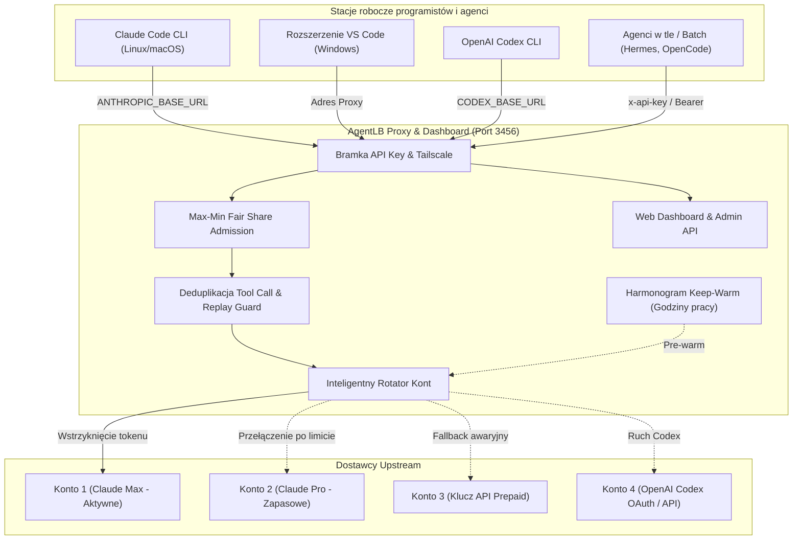

<div align="right">
  <strong>🌐 Język:</strong>
  <a href="README.md">English</a> |
  <a href="README.pl.md"><strong>Polski</strong></a>
</div>

# ⚖️ agent-lb

> **Uniwersalny Load Balancer wielu kont, rotator limitów i nowoczesny Dashboard Webowy dla Claude Code oraz OpenAI Codex CLI.**

[](LICENSE)
[](https://nodejs.org)
[](docker/Dockerfile)
[](package.json)

`agent-lb` działa jako inteligentne proxy pomiędzy Twoimi narzędziami programistycznymi ([Claude Code](https://claude.ai/claude-code), [rozszerzenie VS Code Claude](https://marketplace.visualstudio.com/items?itemName=Anthropic.claude-code), OpenAI Codex CLI, Cursor, Roo Code, OpenCode, Hermes, Aider) a dostawcami modeli AI (Anthropic, OpenAI). Łączy wiele kont Claude (Max, Pro, Team, klucze API) oraz OpenAI Codex w jedną wspólną pulę i automatycznie rotuje ruch przed osiągnięciem limitów — zapobiegając przerwom w pracy programistów i błędom 429 quota exhaustion.

---

## 🌟 Główne zalety i możliwości

- **⚡ Pula wielu kont i adaptacyjna rotacja**: Obsługuje jednocześnie wiele kont Anthropic i OpenAI Codex, automatycznie przełączając na kolejne konto przed wyczerpaniem limitu sesyjnego (okno 5h) lub tygodniowego (7 dni). Domyślny próg to 98% (konfigurowalny).
- **🧠 Podwójne wsparcie dla Claude i OpenAI Codex**: Pełne wsparcie dla zapytań Anthropic Claude (`/v1/messages`) oraz OpenAI Codex / ChatGPT (`/backend-api/codex`, `/backend-api/wham`, `/v1/responses`, `/v1/chat/completions`) z automatyczną obsługą OAuth PKCE i kluczy API.
- **⚖️ Sprawiedliwy podział pasma (Max-Min Fair Share)**: Zapobiega blokowaniu interaktywnych sesji kodowania przez ciężkie zadania wsadowe lub działające w tle autonomiczne agenty (np. Hermes), dynamicznie dławiąc najbardziej agresywne strumienie.
- **⏰ Inteligentny harmonogram i podgrzewanie sesji (Keep-Warm)**: Utrzymuje gotowość i ciepłą pamięć podręczną modeli w godzinach pracy, automatycznie wstrzymując zapytania w nocy i w weekendy, oszczędzając limity kont.
- **🛡️ Deduplikacja wywołań narzędzi i ochrona przed powtórzeniami (Replay Safety)**: Śledzi operacje o skutkach ubocznych (edycje plików, polecenia bash) przy użyciu deterministycznych sygnatur, chroniąc przed podwójnym wykonaniem w przypadku chwilowych problemów z siecią lub automatycznych ponowień klienta.
- **📊 Interaktywny panel webowy w czasie rzeczywistym**: Responsywny Dashboard (`/dashboard`) w języku polskim i angielskim, prezentujący stan kont, zużycie tokenów, aktywne połączenia, salda przedpłat i stacje robocze, odświeżany na żywo przez WebSocket i SSE.
- **🔄 Ponowne logowanie 1-kliknięciem w Dashboardzie**: Wygodne odnawianie wygasłych sesji OAuth kont Anthropic lub OpenAI Codex bezpośrednio w przeglądarce bez konieczności logowania na serwer przez SSH.
- **🛠️ Błyskawiczne instalatory stacji roboczych (All-in-One)**: Jednolinijkowe polecenia instalacyjne dla systemów Linux, macOS, WSL oraz Windows PowerShell, które automatycznie instalują pakiety CLI, konfigurują profile powłoki, rozszerzenia VS Code oraz tworzą kopie zapasowe konfiguracji OAuth.
- **👥 Niezależne klucze stacji roboczych (Multi-Tenant)**: Generowanie osobnych kluczy dostępowych (`tc-...`) dla członków zespołu i agentów, z osobnymi statystykami tokenów, limitami dziennymi/miesięcznymi i ograniczeniami dostawców (`allowedProviders`).
- **🪶 Zero zewnętrznych zależności**: Projekt oparty w 100% na wbudowanych modułach Node.js (`http`, `https`, `crypto`, `net`). Wyjątkowo lekki, startuje w ułamku sekundy.
- **🔒 Bezpieczeństwo od pierwszego uruchomienia**: Automatyczne omijanie bramki dla ruchu lokalnego (loopback) oraz sieci Tailscale, porównania kluczy odporne na ataki czasowe (constant-time), restrykcyjna polityka Content Security Policy (CSP) i zero sekretów w repozytorium.
- **🐳 Gotowy do pracy w Dockerze i pod systemd**: Gotowy plik `Dockerfile`, `docker-compose.yml` oraz prosta integracja jako usługa `systemd`.

---

## 🏗️ Architektura systemu



---

## 🚀 Szybki start (Instalacja serwera)

### Opcja 1: Uruchomienie z repozytorium Git (Zalecane)

Wymagane środowisko: **Node.js 20+**:

```bash
git clone https://github.com/tomaasz/agent-lb.git
cd agent-lb

# Uruchomienie z interaktywnym interfejsem TUI w konsoli
npm start

# Lub uruchomienie w trybie usługi w tle (headless daemon — zalecane dla serwerów)
node src/index.js headless
```

Podczas pierwszego startu, `agent-lb` automatycznie wygeneruje główny klucz administratora i wyświetli adres panelu:

```text
Agent-LB proxy listening on 0.0.0.0:3456
Web Dashboard: http://localhost:3456/dashboard
Admin Key: tc-adm_xxxxxxxxxxxxxxxx
```

---

### Opcja 2: Kontener Docker & Docker Compose

```bash
git clone https://github.com/tomaasz/agent-lb.git
cd agent-lb/docker

# Uruchomienie kontenera w tle
docker compose up -d
```

Konfiguracja i konta są trwale zachowywane w katalogu wolumenu `docker/data/agent-lb.json`.

---

### Opcja 3: Usługa systemowa systemd (Linux)

Instalacja jako usługa użytkownika w `systemd`:

```bash
mkdir -p ~/.config/systemd/user
cat << 'EOF' > ~/.config/systemd/user/agentlb.service
[Unit]
Description=AgentLB Multi-Account Proxy Service
Documentation=https://github.com/tomaasz/agent-lb
After=network.target

[Service]
Type=simple
WorkingDirectory=%h/agent-lb
ExecStart=/usr/bin/node %h/agent-lb/src/index.js headless
Restart=always
RestartSec=5
Environment=NODE_ENV=production

[Install]
WantedBy=default.target
EOF

systemctl --user daemon-reload
systemctl --user enable --now agentlb
```

---

## 💻 Podłączanie klientów (Stacji programistów)

Podłączenie komputera programisty wymaga tylko **jednego polecenia**. Serwer dynamicznie serwuje skrypt instalacyjny dostosowany do Twojego serwera:

### Zunifikowany instalator All-in-One (Claude Code + OpenAI Codex + VS Code)

#### Linux / macOS / WSL:

```bash
# Tryb interaktywny (zapyta o klucz stacji w terminalu):
curl -fsSL http://twoj-serwer:3456/setup.sh | bash

# Tryb natychmiastowy z podaniem klucza:
curl -fsSL http://twoj-serwer:3456/setup.sh | bash -s -- --key tc-KLUCZ_STACJI
```

#### Windows (PowerShell):

```powershell
# Tryb interaktywny:
& ([scriptblock]::Create((irm http://twoj-serwer:3456/setup.ps1)))

# Tryb natychmiastowy z podaniem klucza:
& ([scriptblock]::Create((irm http://twoj-serwer:3456/setup.ps1))) -Key tc-KLUCZ_STACJI
```

> **Wykrywanie WSL na Windowsie**: Skrypt `setup.ps1` uruchomiony w PowerShell automatycznie wykrywa zainstalowane dystrybucje WSL (np. Debian, Ubuntu) i wyświetla gotową komendę, którą możesz wkleić do konsoli WSL, by skonfigurować oba środowiska jednocześnie.

#### Opcje i parametry instalatora:

- `--key <KLUCZ>` / `-Key <KLUCZ>`: Bezpośrednie podanie klucza stacji roboczej.
- `--url <URL>` / `-Url <URL>`: Wskazanie adresu serwera proxy (np. `https://agentlb.twojadomena.pl`).
- `--lang <pl|en>` / `-Lang <pl|en>`: Wymuszenie języka komunikatów instalatora.
- `--test` / `-Test`: Wykonanie testu diagnostycznego połączenia i autoryzacji bez modyfikacji plików.
- `--no-install`: Pominięcie automatycznej instalacji pakietów npm (`@anthropic-ai/claude-code`, `@openai/codex`).
- `--uninstall` / `-Uninstall`: Usunięcie zmiennych proxy ze środowiska i przywrócenie kopii zapasowych konfiguracji.

---

### Co instalator wykonuje w pełni automatycznie:

1. **Weryfikacja środowiska**: Sprawdza dostępność Node.js oraz npm; w razie braku narzędzi CLI automatycznie instaluje globalnie `@anthropic-ai/claude-code` i `@openai/codex`.
2. **Autoryzacja na żywo**: Sprawdza poprawność klucza i komunikację z endpointami serwera (`/v1/models` oraz `/backend-api/codex/models`).
3. **Czysta konfiguracja bez konfliktów OAuth**: Tworzy bezpieczną kopię zapasową istniejących plików (`.bak`) i zapobiega błędom kolizji autoryzacji.
4. **Konfiguracja narzędzi**: Aktualizuje pliki `~/.claude/settings.json` oraz `~/.codex/config.json` / `config.toml`.
5. **Wsparcie dla VS Code**: Automatycznie konfiguruje oficjalne rozszerzenia VS Code dla Claude Code i OpenAI Codex.
6. **Trwałość konfiguracji**: Zapisuje zmienne proxy w profilach powłoki (`~/.bashrc`, `~/.zshrc`, `~/.config/agent-lb.env`) lub w Rejestrze Użytkownika Windows. W przypadku sesji OAuth w `~/.claude/.credentials.json`, instalator zachowuje tryb subskrypcji Claude Code, ustawiając nagłówek `ANTHROPIC_CUSTOM_HEADERS=x-api-key: <klucz-proxy>`. Proxy transparentnie przejmuje ten nagłówek i podmienia dane uwierzytelniające na aktywne konto z puli.

---

## 🖥️ Panel Webowy (Web Dashboard)

Panel zarządzania dostępny jest pod adresem:

```text
http://twoj-serwer:3456/dashboard
```

### Możliwości panelu:

- **🌐 Dwujęzyczność (PL / EN)**: Szybki przełącznik języka w prawym górnym rogu zapamiętywany w przeglądarce.
- **🎨 Tryb ciemny / jasny**: Wygodne dopasowanie motywu graficznego.
- **🤖 Zarządzanie kontami**: Podgląd wykorzystania limitów 5h i 7d, salda prepaid, kolejności priorytetów (metoda przeciągnij-i-upuść ⠿) oraz stanu zdrowia kont.
- **🔐 Logowanie OAuth 1-kliknięciem**: Dodawanie i odnawianie kont Claude oraz Codex bezpośrednio z poziomu przeglądarki (w tym logowanie kodem urządzenia Device Code na serwerach bez GUI).
- **💻 Zarządzanie stacjami**: Generowanie kluczy stacji, limity tokenów, podgląd gotowych komend instalacyjnych z listą wyboru stacji.
- **💬 Test Chat & Playground**: Wbudowany komunikator do bezpośredniego testowania odpowiedzi modeli Claude i Codex na żywo przez proxy.
- **📊 Szczegółowe raporty zużycia (Kto i Na co)**: Raporty tokenów w podziale na stacje, sesje, projekty i modele.

---

## ⚙️ Zaawansowana konfiguracja (`agent-lb.json`)

Konfiguracja przechowywana jest w pliku `agent-lb.json` (lub `~/.config/agent-lb.json`):

```json
{
  "port": 3456,
  "bind": "0.0.0.0",
  "proxy": {
    "apiKey": "tc-adm_twoj_klucz_administratora",
    "thresholdPercent": 98,
    "maxBodyBytes": 67108864,
    "allowedHosts": ["agentlb.twojadomena.pl"]
  },
  "sessions": {
    "mode": "adaptive"
  },
  "expiryRouting": {
    "enabled": true
  },
  "crossProviderFallback": true,
  "autoHealthCheck": {
    "enabled": true,
    "intervalSeconds": 900
  },
  "accounts": [
    {
      "name": "Konto-Claude-Glowne",
      "provider": "anthropic",
      "type": "oauth",
      "priority": 10
    }
  ]
}
```

---

## 🧪 Testy i weryfikacja

Uruchomienie wbudowanego zestawu testów jednostkowych i integracyjnych:

```bash
npm test
```

Projekt posiada ponad 140 rygorystycznych testów sprawdzających routing, autoryzację, deduplikację narzędzi, strumieniowanie SSE oraz obsługę błędów upstream.

---

## 📄 Licencja

Projekt udostępniany na warunkach licencji [MIT](LICENSE).
Możesz go swobodnie wdrażać, modyfikować i hostować we własnej infrastrukturze.
