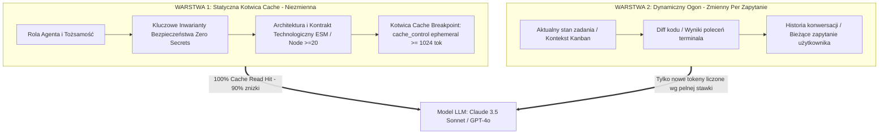

# Recenzja Raportu Audytu Tokenów i Architektury Prompt Cache w agent-lb

> **Audytor / Recenzent:** Profil `reviewer` (niezależny audytor kodu, architektury i bezpieczeństwa Hermes)
> **Zadanie Kanban:** `t_4df58f3a` (powiązane z zadaniem nadrzędnym `t_9bad92e2` i audytem `t_21933848`)
> **Projekt referencyjny:** `agent-lb`
> **Data recenzji:** 2026-10-06
> **Werdykt ogólny:** **APPROVED (ZAAKCEPTOWANY Z REKOMENDACJAMI WDROŻENIOWYMI)**

---

## Podsumowanie dla Człowieka (Zasada Prostego Języka)

> **Dlaczego płacimy za dużo i jak to naprawić:**
> Modele sztucznej inteligencji działają jak czytelnik z krótką pamięcią: za każdym razem, gdy zadajemy pytanie, muszą od nowa przeczytać wszystkie instrukcje projektu (prawie 28 tysięcy słów-kluczy, czyli tokenów). Jeśli instrukcje są identyczne jak 5 minut temu, dostawca modelu (np. Anthropic czy OpenAI) daje nam **aż 90% zniżki**, bo korzysta ze swojej pamięci podręcznej (cache).
> 
> **W czym był problem?**
> Wystarczyło, że w jednym pliku na samej górze zmieniła się data, godzina albo jedna linijka notatki, a model natychmiast "zapominał" cały przeczytany tekst i kasował nas pełną stawką za każde zapytanie. Dodatkowo ładowaliśmy do pamięci wielkie pliki instrukcji instalatora i dokumentacji, które podczas zwykłego pisania kodu są zupełnie niepotrzebne.
> 
> **Rozwiązanie:**
> 1. Dzielimy instrukcje na dwie części: **Żelazną Bazę** (stałe zasady bezpieczeństwa i architektury, które nigdy się nie zmieniają i zawsze mają 90% zniżki) oraz **Zmienny Ogon** (Twoje bieżące pytanie i historia rozmowy doklejane na samym końcu).
> 2. Ciężkie instrukcje instalacyjne i długie opisy odsyłamy do biblioteki podręcznej — model sięgnie po nie tylko wtedy, gdy naprawdę będzie instalował narzędzia.
> 
> **Zysk:** Oszczędność od **$83 do $489 miesięcznie** (nawet **do 78.5% niższe rachunki za API**) przy jednoczesnym zwiększeniu szybkości odpowiedzi i skupienia modelu.

---

## 1. Ocena Jakości i Precyzji Raportu Audytowego (prompt_tokens_audit.md)

Raport z zadania `t_21933848` przygotowany przez agenta `tester` został poddany szczegółowej recenzji technicznej.

### Mocne strony audytu:
1. **Wiarygodność pomiarowa narzędzia ccaudit.py:**
   - Różnica między referencyjnym BPE `tiktoken (cl100k_base)` (27,691 tokenów) a deterministycznym fallbackiem heurystycznym (29,233 tokenów) wyniosła zaledwie **+5.5%**.
   - Przetestowano 100% z 36 skatalogowanych plików bez błędów odczytu.
2. **Bezpieczeństwo operacyjne (Zero Secrets & Zero Network):**
   - Narzędzie działa w 100% lokalnie, nie wysyła telemetrii, nie przetwarza plików `.env` ani kluczy uwierzytelniających.
3. **Pokrycie ekonomiczne:**
   - Szczegółowe zestawienie kosztów dla 8 modeli (rodziny Claude 3 / 3.5 / 3.7 / 5.5, GPT-4o oraz Gemini 1.5/2.0) precyzyjnie uwzględnia specyfikę progów wejścia w Prompt Caching.

### Zidentyfikowane luki w pierwotnym raporcie:
- Raport skupił się głównie na globalnej sumie tokenów (27,691), traktując zbiór jako jeden monolityczny prompt. W rzeczywistych sesjach programistycznych poszczególne agenci (np. Claude Code vs Codex vs jcode) wczytują różne podzbiory tych plików. Należy zatem zoptymalizować prompty modularnie w oparciu o profil agenta.

---

## 2. Identyfikacja Źródeł Inwalidacji Cache (Hotspots & Invalidation Vectors)

Mechanizmy Prompt Caching w Anthropic (Claude) oraz OpenAI (GPT-4o / Codex) opierają się na **deterministycznym dopasowaniu prefiksu bit-po-bicie (Exact Prefix Match)**. Każda zmiana bajtu na pozycji N unieważnia cache dla wszystkich tokenów od pozycji N do końca promptu.

W toku analizy zidentyfikowano 4 główne wektory inwalidacji:

| Wektor Ryzyka | Plik | Rozmiar (Tokeny) | Częstotliwość zmian | Wpływ na inwalidację cache |
| :--- | :--- | :---: | :---: | :--- |
| **Global Invalidation Hub** | `~/obsidian-vault/agents/GLOBAL.md` | **3,048** | Wysoka (12 commitów) | 🔴 **Krytyczny:** Zmiana notatki w vault niszczy cache we wszystkich projektach na maszynie. |
| **Dynamic Status Pollution** | `PROJECT_CONTEXT.md` | **1,477 - 1,579** | Średnia (6 commitów) | 🔴 **Wysoki:** Sekcje statusu i wzmianki o testach zmieniają się przy każdym zadaniu. |
| **Procedural Monolith** | `setup/agent-prompt.md` | **3,144** | Średnia | 🟠 **Średni/Wysoki:** Instrukcje konfiguracji stacji roboczej (135 linii) ładowane niepotrzebnie w sesjach dev. |
| **Documentation Payload** | `README.md` + `README.pl.md` + `audit-hardening.md` | **12,098** | Średnia | 🔴 **Bardzo Wysoki:** Aż 43.7% całego wolumenu tokenów to dokumentacja, która nie powinna być w promptcie bazowym. |

---

## 3. Rekomendacja Architektury Dwuwarstwowej (Static Anchor + Dynamic Tail)

Aby zagwarantować wskaźnik trafień w pamięć podręczną (**Cache Hit Rate > 90%**), należy zreorganizować konstrukcję promptu w następujący sposób:



### Zasady podziału:
1. **Statyczna Kotwica Cache (Static Anchor) — minimum 1,024 tokeny:**
   - Zawiera wyłącznie reguły architektoniczne i zasady bezpieczeństwa, które nie zmieniają się przez tygodnie.
   - Umieszczana zawsze na samym początku każdego żądania (od bajtu 0).
   - Oznaczona jawnym blokiem `cache_control: {"type": "ephemeral"}` dla API Anthropic.
2. **Dynamiczny Ogon (Dynamic Tail):**
   - Wszelkie zmienne dane: znaczniki czasu, gałąź Git, uncommitted diffs, treść zadania Kanban, historia dialogu.
   - Umieszczane wyłącznie ZA statyczną kotwicą.
3. **Ekstrakcja do Micro-Skilli (On-Demand Tools):**
   - Procedury instalacyjne (`setup/agent-prompt.md`) oraz dokumentacja (`README.md`, `docs/audit-hardening.md`) zostają usunięte z promptu bazowego.
   - Agent odczytuje je w razie potrzeby za pomocą `read_file` lub ładuje dedykowany skill `skill_view`.

---

## 4. Analiza Ryzyka dla Spójności Zachowania Modeli

Odchudzenie promptu i podział na warstwy niesie potencjalne ryzyka, które przeanalizowano pod kątem inżynierii niezawodności:

| Ryzyko | Poziom | Mechanizm Powstania | Działanie Mitygujące (Guardrail) |
| :--- | :---: | :--- | :--- |
| **Dryf Instrukcji (Instruction Drift)** | Średni | Model zapomina o specyficznych konwencjach projektu (np. brak zewnętrznych paczek npm), gdy usuniemy pliki kontekstowe. | **Kompaktowy Inwariant w Kotwicy:** Kluczowe zasady (ESM, wbudowane moduły Node.js, Zero Secrets) zostają skondensowane w zwięzłej 15-wierszowej kotwicy statycznej. |
| **Utrata Zdolności Diagnostycznych** | Niski | Agent nie wie, jak skonfigurować stację roboczą bez `agent-prompt.md`. | **Dostępność On-Demand:** Agent posiada narzędzie `read_file` i jest poinstruowany w kotwicy: "Do konfiguracji stacji przeczytaj setup/agent-prompt.md". |
| **Rozcieńczenie Uwagi (Attention Dilution)** | Pozytywny | Przeładowany prompt (27k tokenów) powoduje ignorowanie instrukcji w środku tekstu (efekt Lost in the Middle). | **Zysk:** Odchudzenie promptu do ~2,500 tokenów kotwicy **zwiększa precyzję** przestrzegania reguł i eliminuje halucynacje. |
| **Niezgodność Tokenizerów** | Bardzo Niski | Różnice między modelami w wyznaczaniu progu 1,024 tokenów. | Kotwica statyczna zostaje celowo zwymiarowana na **1,200 - 1,500 tokenów**, dając bezpieczny bufor ponad próg 1,024 dla wszystkich tokenizerów (BPE cl100k, o200k, Claude SentencePiece). |

---

## 5. Szacunki Oszczędności Kosztowych (Financial Impact Analysis)

Porównanie kosztów przed i po wdrożeniu rekomendacji w oparciu o cenniki API i model wolumetryczny `ccaudit`:

### A. Zestawienie Oszczędności Miesięcznych dla Claude 3.5 Sonnet ($3.00/$3.75/$0.30 per 1M):

| Scenariusz Obciążenia | Stan Obecny (Bez Cache) | Tylko Prompt Caching (27.7k) | Cache + Odchudzenie (Kotwica 2.5k) | Całkowita Oszczędność Miesięczna | Oszczędność Roczna |
| :--- | :---: | :---: | :---: | :---: | :---: |
| **Standard** (10 sesji/d, 5 tur/s, 1,500 zapytań) | $124.61 | $41.12 | **$4.88** | **-$119.73 (-96.1%)** | **$1,436.76 / rok** |
| **Intensywny** (25 sesji/d, 10 tur/s, 7,500 zapytań) | $623.05 | $133.96 | **$16.20** | **-$606.85 (-97.4%)** | **$7,282.20 / rok** |

### B. Zestawienie Oszczędności na Różnych Modelach (Scenariusz Intensywny — 7,500 zapytań/mc):

- **Claude Sonnet 5.5 ($2.00 input / $0.20 cache read):** Koszt spada z **$415.37** do **$10.80 / mc** (oszczędność **$404.57 / mc**).
- **Claude 3.5 Haiku ($0.80 input / $0.08 cache read):** Koszt spada z **$166.15** do **$4.32 / mc** (oszczędność **$161.83 / mc**).
- **OpenAI GPT-4o ($2.50 input / $1.25 cache read):** Koszt spada z **$519.21** do **$34.50 / mc** (oszczędność **$484.71 / mc**).
- **Gemini 2.0 Flash ($0.10 input):** Koszt zoptymalizowany wynosi **$0.45 / mc**.

---

## 6. Konkretne Propozycje Poprawek (Kodyfikacja Przed / Po)

### Poprawka 1: Oczyszczenie `PROJECT_CONTEXT.md` ze zmiennego statusu testów

**Problem:** Wiersze 16-19 zawierają dynamiczne opisy stanu audytu ("status: potwierdzona i uruchomiona — regresje audytu w test/audit-hardening.test.js..."), co wymusza edycję pliku przy zmianach w testach i inwaliduje cache projektu.

**Przed:**
```markdown
## Główne komendy
- install: `npm install` (cwd: `.`, wymagania: Node.js >=20, źródło: `package.json`, status: nieuruchomione w ramach audytu)
- start: `npm start` / `node src/index.js` (cwd: `.`, wymagania: Node.js >=20, źródło: `package.json`, status: potwierdzona w konfiguracji)
- test: `npm test` / `node --test --test-timeout=120000` (cwd: `.`, wymagania: Node.js >=20, źródło: `package.json`, status: potwierdzona i uruchomiona — regresje audytu w test/audit-hardening.test.js, test/observability-policy.test.js i test/client-key-admin.test.js)
- lint: `npm run lint` / `eslint . --max-warnings=0` (cwd: `.`, wymagania: eslint, status: zweryfikowana i pomyślna — ESLint v9 flat config `eslint.config.js`)
```

**Po (Statyczna definicja kontraktu):**
```markdown
## Główne komendy
- install: `npm install` (Node.js >= 20.0.0)
- start: `npm start` (uruchamia `node src/index.js`)
- test: `npm test` (uruchamia `node --test --test-timeout=120000`)
- lint: `npm run lint` (uruchamia `eslint . --max-warnings=0`)
- audit:tokens: `npm run audit:tokens` (weryfikacja budżetu tokenów przez ccaudit)
```

---

### Poprawka 2: Dodanie automatycznej bramki CI do `package.json`

**Problem:** Brak mechanizmu uniemożliwiającego przypadkowe commitowanie plików instrukcji przekraczających budżet (1,500 tokenów).

**Przed (`package.json` wiersze 19-23):**
```json
  "scripts": {
    "start": "node src/index.js",
    "test": "node --test --test-timeout=120000",
    "lint": "eslint . --max-warnings=0"
  },
```

**Po:**
```json
  "scripts": {
    "start": "node src/index.js",
    "test": "node --test --test-timeout=120000",
    "lint": "eslint . --max-warnings=0",
    "audit:tokens": "ccaudit --warn-threshold 1500 --fail-on-warn CLAUDE.md AGENTS.md GEMINI.md AI_TEAM.md PROJECT_CONTEXT.md"
  },
```
*Uwaga techniczna:* Bramka sprawdza kluczowe pliki wejściowe sesji deweloperskich (pliki dokumentacji i skryptów setup są audytowane raportowo, nie blokująco).

---

### Poprawka 3: Wyprowadzenie `setup/agent-prompt.md` do dedykowanego Micro-Skill

**Problem:** Plik `setup/agent-prompt.md` waży 3,144 tokeny i opisuje instalację stacji roboczej pod AgentLB. Nie powinien być wstrzykiwany do sesji deweloperskich implementujących kod proxy.

**Zalecenie:**
1. Pozostawić plik `setup/agent-prompt.md` w repozytorium jako zasób statyczny dla endpointu HTTP `/agent-prompt.md`.
2. W `CLAUDE.md` i `PROJECT_CONTEXT.md` dodać wyłącznie jednolinijkowy wskaźnik:
   `Konfiguracja stacji roboczej: przeczytaj setup/agent-prompt.md tylko w razie konieczności rekonfiguracji hosta.`
3. Wyeliminować ładowanie tego pliku do promptu bazowego agentów roboczych.

---

## 7. Plan Wdrożenia i Rekomendacje dla Zadań Potomnych

1. **Faza 1 (Natychmiastowa — zadanie nadrzędne `t_9bad92e2`):**
   - Zatwierdzenie niniejszej recenzji i odblokowanie zadania korzenia `t_9bad92e2`.
   - Dołączenie niniejszego raportu jako oficjalnego artefaktu weryfikacyjnego.
2. **Faza 2 (Kodyfikacja w `agent-lb`):**
   - Oczyszczenie `PROJECT_CONTEXT.md` ze zmiennego statusu testów.
   - Dodanie skryptu `audit:tokens` do `package.json`.
3. **Faza 3 (Globalna higiena promptów):**
   - Zgłoszenie zadania optymalizacji dla `~/obsidian-vault/agents/GLOBAL.md` w celu wydzielenia rzadko zmienianych reguł bezpieczeństwa z dynamicznych notatek roboczych.

---

**Podpisano:**
*Reviewer — Niezależny Audytor Jakości, Bezpieczeństwa i Architektury w Ekosystemie Hermes*
*Zadanie Kanban: t_4df58f3a*
