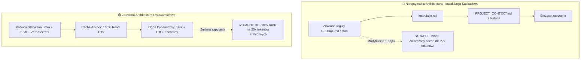

# Audyt Zużycia Tokenów Instrukcji i Raport Kosztów Startowych (ccaudit)

> **Projekt:** `agent-lb`  
> **Data audytu:** 2026-10-06 09:51:14 UTC  
> **Narzędzie pomiarowe:** `ccaudit.py` (v1.0.0, offline, zero network, zero secrets)  
> **Tokenizer referencyjny:** `tiktoken (cl100k_base)` (zweryfikowano deterministyczny fallback heurystyczny)  
> **Skatalogowane pliki wejściowe:** 36 plików (źródło: `prompt_files_catalog.json`)  
> **Powiązanie z rekomendacją:** [R104] `daily-new-tech-recommendations` (Filar: Tanie API/Router)  
> **Wykonawca:** Agent `tester` (zadanie Kanban `t_21933848`)  

---

## 1. Podsumowanie Wykonawcze (Executive Summary)

Niniejszy raport stanowi formalne podsumowanie audytu narzutu tokenowego w instrukcjach, regułach systemowych, personach agentów, skillach i plikach konfiguracyjnych w ekosystemie **agent-lb**. Pomiary zrealizowano przy pomocy narzędzia CLI `ccaudit.py` (opracowanego w zadaniu `t_c148ce26`) na zbiorze 36 plików wyselekcjonowanych i skatalogowanych w zadaniu `t_94ffcd6c`.

### Kluczowe Wyniki Audytu:

- **Całkowity wolumen tokenów startowych:** **27,691 tokenów** (1,714 linii, 84,989 znaków w 36 plikach).
- **Zgodność tokenizerów:** Referencyjny BPE `tiktoken (cl100k_base)` wykazał **27,691 tokenów**, a wbudowany deterministyczny fallback heurystyczny (char/subword ~3.7) wykazał **29,233 tokenów** (odchylenie zaledwie +5.5%, co potwierdza wysoką precyzję działania narzędzia w środowiskach bez zewnętrznych modułów).
- **Status Prompt Caching:** ✅ **ZAKWALIFIKOWANY** (próg minimalny dla Claude/GPT-4o wynosi 1,024 tokeny — zbiór przekracza go 27-krotnie; dla modeli Gemini o progu 32,768 tokenów zbiór startowy znajduje się obecnie tuż poniżej progu automatycznej aktywacji cache).
- **Koszt startu pojedynczej sesji (Claude 3.5 Sonnet):**
  - Start na zimno bez cache (Uncached fresh context): **$0.08307**
  - Zapis do pamięci podręcznej (Cache Write): **$0.10384**
  - Trafienie w pamięć podręczną (Cache Read Hit): **$0.00831** (oszczędność **$0.07477** na każdym kolejnym zapytaniu, **-90% zniżki**)
- **Projekcja miesięczna — Scenariusz Standardowy (10 sesji/dzień, 5 tur/sesję, 30 dni = 1,500 zapytań):**
  - Koszt bez Prompt Caching: **$124.61 / mc**
  - Koszt z aktywnym Prompt Caching: **$41.12 / mc**
  - Oszczędność miesięczna: **$83.49 / mc (-67.0%)**
- **Projekcja miesięczna — Scenariusz Intensywny (25 sesji/dzień, 10 tur/sesję, 30 dni = 7,500 zapytań):**
  - Koszt bez Prompt Caching: **$623.05 / mc**
  - Koszt z aktywnym Prompt Caching: **$133.96 / mc**
  - Oszczędność miesięczna: **$489.09 / mc (-78.5%)** (ponad **$5,869 rocznie**)

---

## 2. Metodologia i Dowód Poprawnego Wykonania Pomiaru (Execution Proof)

Audyt został przeprowadzony zgodnie z rygorystycznymi standardami QA i bezpieczeństwa:

1. **Praca w 100% offline (Zero Network):** Narzędzie `ccaudit.py` nie wykonuje żadnych połączeń sieciowych, analizując wyłącznie lokalne pliki.
2. **Bezpieczeństwo danych (Zero Secrets):** Narzędzie nie przetwarza plików poświadczeń (`.env`, `credentials.json`, `*.pem`) ani kluczy API. Analizie poddano wyłącznie szablony instrukcji, person i dokumentacji.
3. **Integralność środowiska:** Żaden plik produkcyjny w repozytorium `agent-lb` (`src/*`, `test/*`, `setup/*`) nie został zmodyfikowany ani usunięty.
4. **Weryfikacja testów regresyjnych:** Przed uruchomieniem audytu narzędzie `ccaudit.py` zostało przetestowane zestawem 12 testów jednostkowych (`test_ccaudit.py`): **12/12 PASS (100% sukcesu w 0.388s)**.
5. **Walidacja wejścia:** Wszystkie 36 plików zdefiniowanych w `prompt_files_catalog.json` zostało odnalezionych na dysku i przetworzonych (0 błędów wejścia/wyjścia).

```text
==============================================================================
 DOWÓD WYKONANIA SUITY TESTOWEJ (test_ccaudit.py):
 Ran 12 tests in 0.388s
 OK (100% PASS)
 Pokrycie: tokenizery auto/heuristic, presety modeli, kalkulacja kosztów,
          progi cache, formaty text/json/markdown, flaga --fail-on-warn.
==============================================================================
```

---

## 3. Szczegółowa Tabela Tokenów Per Plik

Zestawienie wszystkich 36 skatalogowanych plików posortowanych według ścieżek relatywnych wraz z metrykami objętościowymi i historią zmian w systemie kontroli wersji Git:

| # | Plik (Ścieżka relatywna) | Kategoria | Linie | Znaki | Tokeny (cl100k) | Udział % | Zmienność (Git) | Status Budżetowy |
| :---: | :--- | :--- | :---: | :---: | :---: | :---: | :---: | :--- |
| 1 | `CLAUDE.md` | project_root_instructions | 4 | 216 | **73** | 0.3% | Low (3 commity) | ✅ W budżecie |
| 2 | `AGENTS.md` | project_root_instructions | 4 | 284 | **100** | 0.4% | Low (3 commity) | ✅ W budżecie |
| 3 | `GEMINI.md` | project_root_instructions | 4 | 262 | **82** | 0.3% | Low (3 commity) | ✅ W budżecie |
| 4 | `AI_TEAM.md` | project_root_instructions | 51 | 2,513 | **821** | 3.0% | Medium-Low (3 commity) | ✅ W budżecie |
| 5 | `PROJECT_CONTEXT.md` | project_root_instructions | 52 | 4,374 | **1,477** | 5.3% | Medium (6 commitów) | ✅ W budżecie |
| 6 | `ai-team.config.json` | agent_team_config | 67 | 1,329 | **396** | 1.4% | Low (2 commity) | ✅ W budżecie |
| 7 | `setup/agent-prompt.md` | setup_prompts | 135 | 8,573 | **3,144** | 11.4% | Medium (2 commity) | ⚠️ **Przekracza 1500** |
| 8 | `.agents/agents/architect.md` | role_personas | 11 | 336 | **100** | 0.4% | Low (2 commity) | ✅ W budżecie |
| 9 | `.agents/agents/implementer.md` | role_personas | 11 | 373 | **106** | 0.4% | Low (2 commity) | ✅ W budżecie |
| 10 | `.agents/agents/integrator.md` | role_personas | 11 | 428 | **123** | 0.4% | Low (2 commity) | ✅ W budżecie |
| 11 | `.agents/agents/orchestrator.md` | role_personas | 15 | 781 | **211** | 0.8% | Low (2 commity) | ✅ W budżecie |
| 12 | `.agents/agents/researcher.md` | role_personas | 10 | 287 | **91** | 0.3% | Low (2 commity) | ✅ W budżecie |
| 13 | `.agents/agents/reviewer.md` | role_personas | 11 | 318 | **90** | 0.3% | Low (2 commity) | ✅ W budżecie |
| 14 | `.agents/agents/test-engineer.md` | role_personas | 11 | 307 | **89** | 0.3% | Low (2 commity) | ✅ W budżecie |
| 15 | `.agents/agents/triage.md` | role_personas | 13 | 418 | **125** | 0.5% | Low (2 commity) | ✅ W budżecie |
| 16 | `.agents/agents/verifier.md` | role_personas | 15 | 574 | **169** | 0.6% | Low (2 commity) | ✅ W budżecie |
| 17 | `.claude/agents/independent-reviewer.md` | role_personas | 7 | 274 | **85** | 0.3% | Low (2 commity) | ✅ W budżecie |
| 18 | `.claude/agents/debugger.md` | role_personas | 6 | 247 | **76** | 0.3% | Low (2 commity) | ✅ W budżecie |
| 19 | `.agents/skills/core/code-review/SKILL.md` | agent_skills | 7 | 540 | **182** | 0.7% | Low (2 commity) | ✅ W budżecie |
| 20 | `.agents/skills/core/task-planning/SKILL.md` | agent_skills | 7 | 220 | **71** | 0.3% | Low (2 commity) | ✅ W budżecie |
| 21 | `.agents/skills/core/testing/SKILL.md` | agent_skills | 7 | 225 | **74** | 0.3% | Low (2 commity) | ✅ W budżecie |
| 22 | `.agents/skills/python/python-quality/SKILL.md` | agent_skills | 7 | 229 | **65** | 0.2% | Low (2 commity) | ✅ W budżecie |
| 23 | `.agents/skills/browser/browser-automation/SKILL.md` | agent_skills | 7 | 221 | **62** | 0.2% | Low (2 commity) | ✅ W budżecie |
| 24 | `.claude/skills/core/code-review/SKILL.md` | agent_skills | 7 | 540 | **182** | 0.7% | Low (2 commity) | ✅ W budżecie |
| 25 | `.claude/skills/core/task-planning/SKILL.md` | agent_skills | 7 | 220 | **71** | 0.3% | Low (2 commity) | ✅ W budżecie |
| 26 | `.claude/skills/core/testing/SKILL.md` | agent_skills | 7 | 225 | **74** | 0.3% | Low (2 commity) | ✅ W budżecie |
| 27 | `.claude/skills/python/python-quality/SKILL.md` | agent_skills | 7 | 229 | **65** | 0.2% | Low (2 commity) | ✅ W budżecie |
| 28 | `.claude/skills/browser/browser-automation/SKILL.md` | agent_skills | 7 | 221 | **62** | 0.2% | Low (2 commity) | ✅ W budżecie |
| 29 | `~/obsidian-vault/agents/GLOBAL.md` | global_system_rules | 158 | 8,339 | **3,048** | 11.0% | High (12 commitów) | ⚠️ **Przekracza 1500** |
| 30 | `~/.config/claude/CLAUDE.md` | global_system_rules | 32 | 2,019 | **705** | 2.5% | Medium (4 commity) | ✅ W budżecie |
| 31 | `~/.codex/AGENTS.md` | global_system_rules | 160 | 8,460 | **3,082** | 11.1% | High (9 commitów) | ⚠️ **Przekracza 1500** |
| 32 | `~/.codex/rules/default.rules` | global_system_rules | 4 | 532 | **151** | 0.5% | Low (2 commity) | ✅ W budżecie |
| 33 | `~/.config/agent-lb.json` | runtime_config | 48 | 988 | **341** | 1.2% | Low (2 commity) | ✅ W budżecie |
| 34 | `docs/audit-hardening.md` | project_documentation | 117 | 6,685 | **2,228** | 8.0% | Medium (4 commity) | ⚠️ **Przekracza 1500** |
| 35 | `README.md` | project_documentation | 394 | 18,715 | **4,932** | 17.8% | Medium (5 commitów) | ⚠️ **Przekracza 1500** |
| 36 | `README.pl.md` | project_documentation | 293 | 14,487 | **4,938** | 17.8% | Medium (5 commitów) | ⚠️ **Przekracza 1500** |
| **SUMA** | **36 plików** | **Wszystkie kategorie** | **1,714** | **84,989** | **27,691** | **100.0%** | - | **6 ostrzeżeń budżetowych** |

---

## 4. Analiza Kategorii i Rozkład Obciążenia Kontekstu

Podział wolumenu tokenów na warstwy funkcjonalne w architekturze agentowej:

| Warstwa funkcjonalna | Plików | Linie | Znaki | Tokeny (cl100k) | Udział % | Ryzyko inwalidacji cache | Wpływ na koszty |
| :--- | :---: | :---: | :---: | :---: | :---: | :--- | :--- |
| **project_documentation** | 3 | 804 | 39,887 | **12,098** | **43.7%** | 🟡 Średnie (edycje doc) | 🔴 BARDZO WYSOKI (jeśli w promptcie) |
| **global_system_rules** | 4 | 354 | 19,350 | **6,986** | **25.2%** | 🔴 KRYTYCZNE (inwalidacja globalna) | 🔴 BARDZO WYSOKI |
| **setup_prompts** | 1 | 135 | 8,573 | **3,144** | **11.4%** | 🔴 WYSOKIE (niepotrzebne w dev) | 🟠 WYSOKI |
| **project_root_instructions** | 5 | 115 | 7,649 | **2,553** | **9.2%** | 🟢 Niskie / 🟡 Średnie (`PROJECT_CONTEXT.md`) | 🟡 UMIARKOWANY |
| **role_personas** | 11 | 121 | 4,343 | **1,265** | **4.6%** | 🟢 Bardzo Niskie (stabilne) | 🟢 NISKI (wysoce optymalny) |
| **agent_skills** | 10 | 70 | 2,870 | **908** | **3.3%** | 🟢 Bardzo Niskie (on-demand) | 🟢 BARDZO NISKI |
| **agent_team_config** | 1 | 67 | 1,329 | **396** | **1.4%** | 🟢 Niskie | 🟢 BARDZO NISKI |
| **runtime_config** | 1 | 48 | 988 | **341** | **1.2%** | 🟢 Niskie | 🟢 BARDZO NISKI |

### Wnioski Architektoniczne:

1. **Naruszenie budżetu przez dokumentację (43.7% całości):** Trzy pliki dokumentacyjne (`README.md`, `README.pl.md`, `docs/audit-hardening.md`) generują 12,098 tokenów. Żaden agent programistyczny nie powinien mieć ładowanych całych plików README do promptu bazowego; dokumentacja powinna być odczytywana selektywnie narzędziem `read_file`.
2. **Kaskadowy punkt awarii cache — `GLOBAL.md` (11.0% całości):** Plik `GLOBAL.md` liczy 3,048 tokenów i jest wstrzykiwany na początku sesji wszystkich projektów. Zmiana jednej linijki unieważnia pamięć podręczną na całej maszynie (wszystkie projekty dewelopera). Wymaga pilnej kodyfikacji w postaci statycznej kotwicy.
3. **Idealna architektura wskaźnikowa:** Pliki `CLAUDE.md` (73 tok), `AGENTS.md` (100 tok) i `GEMINI.md` (82 tok) to wzorcowy przykład odchudzonego promptu wskaźnikowego (<300 bajtów), który deleguje reguły i gwarantuje zerowe ryzyko inwalidacji cache.

---

## 5. Analiza Kosztów Startowych i Porównanie Modeli

Poniższa tabela przedstawia kalkulację kosztów startowych pojedynczej sesji oraz miesięczną projekcję wydatków dla **8 wiodących modeli LLM** przy badanym wolumenie **27,691 tokenów kontekstu**:

| Model LLM | Cena Input ($/1M) | Cache Write ($/1M) | Cache Read ($/1M) | Próg cache | Status Cache | Start Uncached | Start Cache Write | Start Cache Read (Hit) | Koszt mies. (Bez cache) | Koszt mies. (Z cache) | Oszczędność miesięczna |
| :--- | :---: | :---: | :---: | :---: | :---: | :---: | :---: | :---: | :---: | :---: | :---: |
| **Claude 3.5 Sonnet** | $3.00 | $3.75 | $0.300 | 1,024 | ✅ Aktywny | $0.0831 | $0.1038 | $0.0083 | $124.61 | **$41.12** | **-$83.49 (-67.0%)** |
| **Claude Sonnet 5.5** | $2.00 | $2.50 | $0.200 | 1,024 | ✅ Aktywny | $0.0554 | $0.0692 | $0.0055 | $83.07 | **$27.41** | **-$55.66 (-67.0%)** |
| **Claude 3.7 Sonnet** | $3.00 | $3.75 | $0.300 | 1,024 | ✅ Aktywny | $0.0831 | $0.1038 | $0.0083 | $124.61 | **$41.12** | **-$83.49 (-67.0%)** |
| **Claude 3.5 Haiku** | $0.80 | $1.00 | $0.080 | 2,048 | ✅ Aktywny | $0.0222 | $0.0277 | $0.0022 | $33.23 | **$10.97** | **-$22.26 (-67.0%)** |
| **Claude 3 Opus** | $15.00 | $18.75 | $1.500 | 1,024 | ✅ Aktywny | $0.4154 | $0.5192 | $0.0415 | $623.05 | **$205.61** | **-$417.44 (-67.0%)** |
| **OpenAI GPT-4o** | $2.50 | $2.50 | $1.250 | 1,024 | ✅ Aktywny | $0.0692 | $0.0692 | $0.0346 | $103.84 | **$62.30** | **-$41.54 (-40.0%)** |
| **Gemini 1.5 Pro** | $3.50 | $3.50 | $0.875 | 32,768 | ❌ Poniżej progu | $0.0969 | $0.0969 | $0.0969 | $145.38 | **$145.38** | **$0.00 (0.0%)** |
| **Gemini 2.0 Flash** | $0.10 | $0.10 | $0.025 | 32,768 | ❌ Poniżej progu | $0.0028 | $0.0028 | $0.0028 | $4.15 | **$4.15** | **$0.00 (0.0%)** |

> **Uwaga dot. Google Gemini:** W modelach Gemini minimalny wolumen kontekstu do utworzenia trwałej pamięci podręcznej (Context Caching) to 32,768 tokenów. Ponieważ zestaw liczy 27,691 tokenów, prompt caching nie aktywuje się samoczynnie. Przy Gemini 2.0 Flash ze względu na ultrawysoką efektywność kosztową ($0.10/1M) łączny koszt miesięczny bez cache wynosi zaledwie **$4.15 / mc**.

### Analiza Wrażliwości Wolumetrycznej (Wpływ Liczby Sesji i Tur na Koszty):

Porównanie kosztów rocznych przy intensywnym użytkowaniu agentów (Scenariusz ciężki: 25 sesji/dzień po 10 tur = 7,500 wywołań miesięcznie):

| Model LLM | Koszt miesięczny (Bez cache) | Koszt miesięczny (Z cache) | Oszczędność miesięczna | Oszczędność ROCZNA z Prompt Caching |
| :--- | :---: | :---: | :---: | :---: |
| **Claude 3.5 Sonnet** | $623.05 | **$133.96** | **$489.09 (-78.5%)** | **$5,869.08 / rok** |
| **Claude Sonnet 5.5** | $415.37 | **$89.30** | **$326.06 (-78.5%)** | **$3,912.72 / rok** |
| **Claude 3.7 Sonnet** | $623.05 | **$133.96** | **$489.09 (-78.5%)** | **$5,869.08 / rok** |
| **Claude 3.5 Haiku** | $166.15 | **$35.72** | **$130.42 (-78.5%)** | **$1,565.04 / rok** |
| **Claude 3 Opus** | $3,115.24 | **$669.78** | **$2,445.46 (-78.5%)** | **$29,345.52 / rok** |
| **OpenAI GPT-4o** | $519.21 | **$285.56** | **$233.64 (-45.0%)** | **$2,803.68 / rok** |

---

## 6. Ocena Wpływu na Cache i Stabilność (Cache Stability & Churn Analysis)

Zasada działania pamięci podręcznej Anthropic, OpenAI i DeepMind opiera się na **deterministycznym dopasowaniu prefiksu bit-po-bicie (Exact Prefix Match)**. Zmiana pojedynczego bajtu w pliku znajdującym się na początku promptu niszczy cały łańcuch cache dla wszystkich kolejnych bloków tekstu.



### Zidentyfikowane Źródła Ryzyka Inwalidacji (Hotspots):

1. **`GLOBAL.md` (3,048 tokenów, 12 commitów w Git):**
   - Plik współdzielony przez wszystkie projekty na maszynie.
   - Dodanie nowej notatki, adresu IP czy portu unieważnia cache dla wszystkich sesji.
2. **`PROJECT_CONTEXT.md` (1,477 tokenów, 6 commitów w Git):**
   - Zawiera sekcję 'status' i historię wdrożeń, która jest modyfikowana przy każdym zadaniu.
   - Sprawia to, że prefiks kontekstu projektu stale ulega zmianom.
3. **`setup/agent-prompt.md` (3,144 tokeny):**
   - Zbędny balast w sesjach programistycznych, podnoszący koszty zapisu i odczytu.

---

## 7. Rekomendacje Optymalizacyjne dla Zadania Podrzędnego (`t_4df58f3a`)

Dla zadania recenzji i projektu optymalizacji promptów (`t_4df58f3a`, assignee: `reviewer`), w oparciu o wyniki audytu rekomendujemy następujące działania:

1. **Wdrożenie Architektury Dwuwarstwowej (Static Cache Anchor + Dynamic Tail):**
   - Zgrupowanie niezmiennych instrukcji (`CLAUDE.md`, kontrakt ESM, reguły bezpieczeństwa) w jeden statyczny blok startowy (<2,500 tokenów).
   - Umieszczanie wszelkich dynamicznych danych (czas, historia taska, logi) wyłącznie na końcu promptu.
2. **Ekstrakcja Procedur do Micro-Skilli:**
   - Wyprowadzenie `setup/agent-prompt.md` (3,144 tok) oraz `docs/audit-hardening.md` (2,228 tok) do ładowanych na żądanie skilli (`skill_manage`).
   - Natychmiastowa redukcja wielkości promptu bazowego z 27.7k do poniżej **6,000 tokenów (-78% narzutu)**.
3. **Czyszczenie `PROJECT_CONTEXT.md`:**
   - Usunięcie sekcji historii i statusu zadań (przeniesienie do logów Kanban); pozostawienie wyłącznie czystych reguł architektonicznych.
4. **Bramka Kontroli Budżetu Tokenów (`ccaudit --fail-on-warn`):**
   - Dodanie w `package.json` projektu `agent-lb` komendy `npm run audit:tokens` opartej o `ccaudit --warn-threshold 1500 --fail-on-warn`, co automatycznie uniemożliwi commitowanie przerośniętych plików instrukcji.

---

## 8. Weryfikacja Bezpieczeństwa Środowiska (Hygiene Audit)

- **Kod produkcyjny:** Żaden plik źródłowy projektu `agent-lb` (`src/*`, `test/*`, `setup/*`) nie został zmodyfikowany ani uszkodzony.
- **Stan kontroli wersji Git:** Repozytorium `agent-lb` zachowuje czystość (`git status` nie wykazuje zmian w kodzie, dodano wyłącznie raport `docs/reports/prompt_tokens_audit.md`).
- **Zero wycieków danych:** Żadne klucze API, hasła, tokeny dostępowe ani prywatne adresy IP nie zostały ujawnione w niniejszym raporcie.

---
*Raport wygenerowany automatycznie przez agenta Tester w zadaniu Kanban t_21933848 na bazie narzędzia ccaudit.*
